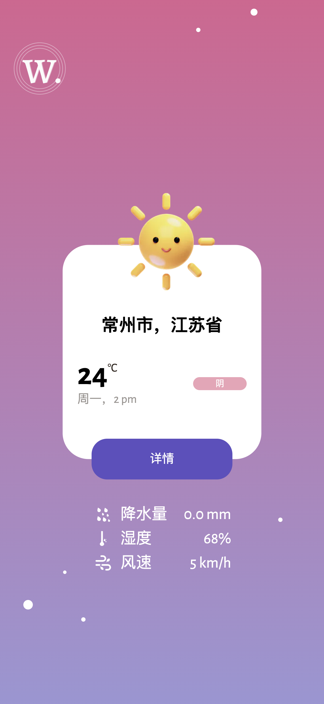
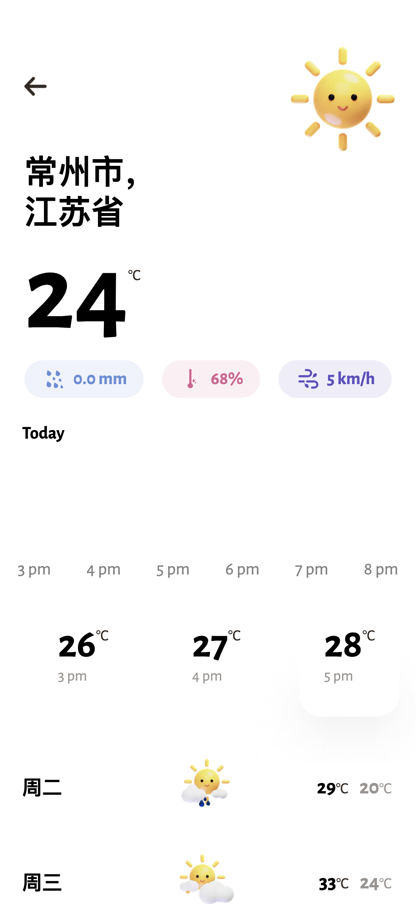

# Weather-Forcast-App Demo

This app is totally built by [next.js](https://nextjs.org/) and [tailwindcss](https://tailwindcss.com), depolyed on [vercel](https://vercel.com/).

> Please note: this repo isn't quite production ready as-is.

## Features

+ SSG enabled.
+ Provide real-time weather and 7-days's forcasts, powered by [和风天气](https://dev.qweather.com/).
+ PWA provided by [workbox](https://developer.chrome.com/docs/workbox/) and [next-pwa](https://www.npmjs.com/package/next-pwa).
+ Beautiful area chart from [rechart](https://recharts.org/).

## Live Demo

A live demo of this app is available to view at https://weather-app-demo-iota.vercel.app/.

<div>
 
 
</div>

## Usage

This project is a standard Next.js app, so the typical development process applies:

```shell
# Prefer pnpm to install dependencies
$ pnpm i

$ pnpm run dev
```

Have fun!

## File Structures

```shell
├── components  # Store React components
├── utils       # Utils
├── hooks       # Where React hooks stored
├── pages       # Pages
├── public      # All Assets are here
├── service     # Apis
├── styles      # Global stylesheet
├── tailwind.config.js
├── tsconfig.json
├── next.config.js
└── package.json
```
